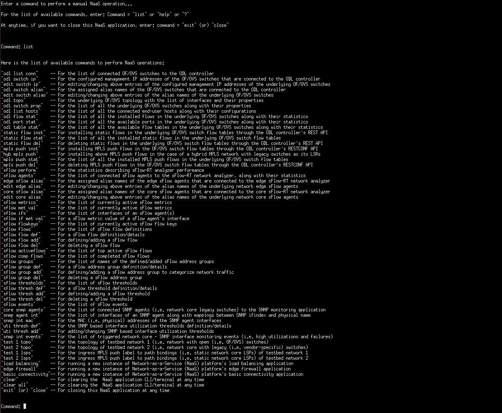
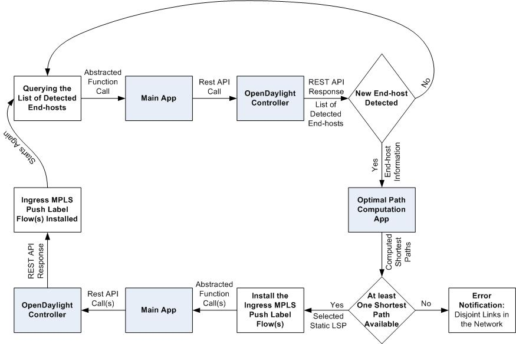
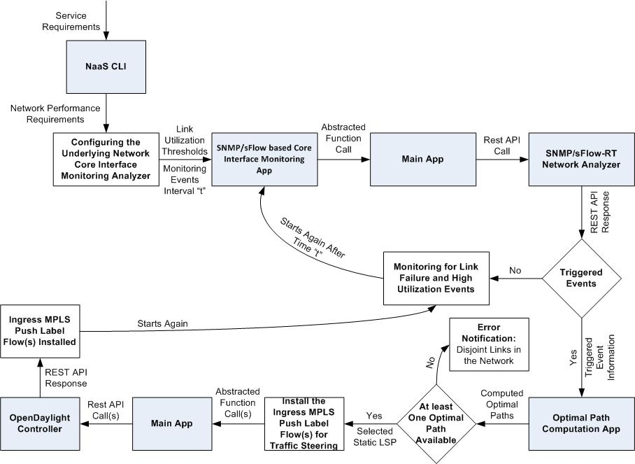
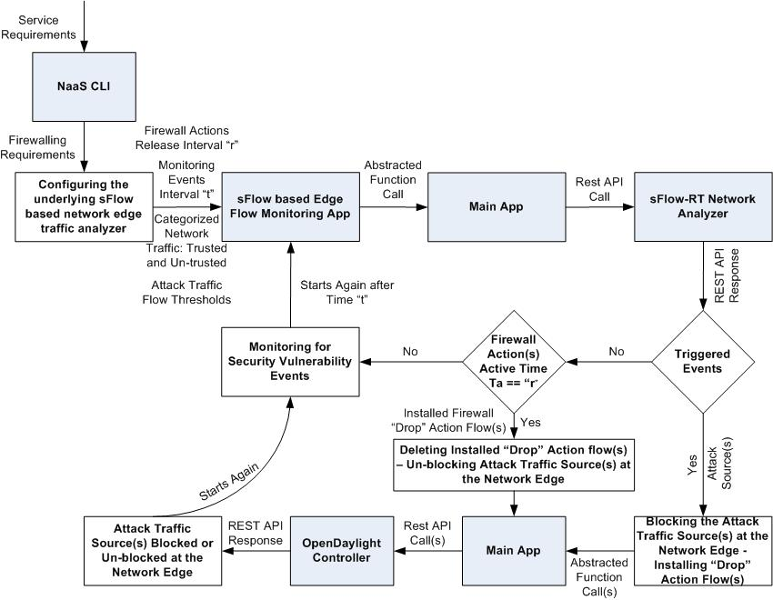

# NaaSPlatform

NaaSPlatform is a software-based application platform, which is written and developed as a step towards realizing an SDN-based architecture for Network-as-a-Service (NaaS) cloud-based service model.

When using NaaSPlatform please refer to the accompanying article: Mani Prashanth Varma Manthena, Niels L. M. van Adrichem, Casper van den Broek and Fernando A. Kuipers, An SDN-based Architecture for Network-as-a-Service, IEEE Conference on Network Softwarization (IEEE NetSoft), London, UK, April 13-17, 2015 http://www.nas.ewi.tudelft.nl/people/Fernando/papers/SDN4NaaS.pdf

NaaSPlatform is configured by default for proof-of-concept (PoC) testbed setups (Testbed Setup A and B) mentioned in the above article. However, if you want to use it for other testbed setups, you need to make some changes to the source code configuration files of NaaSPlatform. Information regarding these required changes to the source code configuration files of NaaSPlatform is mentioned in the section Custom Testbed Setups at the end of this document.

## Prerequisites

NaaSPlatform is completely written in Python 2.7 due to its simplicity, interoperability, support and platform agnostic nature. Thus, NaaSPlatform will run in all OS distributions and environments with Python version 2.x installed. 

NaaSPlatform has been tested and implemented in systems with Debian-based Linux OS and Python version 2.7 installed.

### Python packages

NaaSPlatform requires the following Python packages:

1. Requests
2. NetworkX
3. NumPy & SciPy

You can install these packages using the following terminal commands:

`$ sudo apt-get install python-pip python-dev build-essential` 

`$ sudo pip install --upgrade pip` 

`$ sudo pip install --upgrade virtualenv`

`$ sudo pip install requests networkx python-numpy python-scipy python-matplotlib ipython ipython-notebook python-pandas python-sympy python-nose`

### Terminal emulator

NaaSPlatform requires simultaneous execution of several python scripts in its source code. Thus, the system that hosts NaaSPlatform mush have a terminal emulator like xterm installed. 

You can install xterm terminal emulator using the following terminal command:

`$ sudo apt-get install xterm`

Note: If you want to use a terminal emulator other than xterm, you need to make corresponding changes to the start.sh script in the source code of NaaSPlatform. 

### Applications

NaaSPlatform requires the following applications as its prerequisites:

1. OpenDaylight Controller (Base Edition) as its OpenFlow based SDN controller application
2. sFlow-RT network analyzer as its sFlow based network edge traffic flow monitoring application
3. Custom built SNMP web application (PoC Testbed Setup A) (or) sFlow-RT network analyzer (PoC Testbed Setup B) as its network core interface monitoring application

#### OpenDaylight Controller (Base Edition)

Before starting with the installation of OpenDaylight Controller, check and verify whether your system's Java is properly installed and its environment variables are properly configured.

##### Installation

Download and un-zip the latest OpenDaylight Controller artifact, refer [OpenDaylight CrossProject: Integration Group: Controller Artifacts wiki](https://wiki.opendaylight.org/view/CrossProject:Integration_Group:Controller_Artifacts). 

Hydrogen stable distribution artifacts (till September, 2014) of OpenDaylight Controller (Base Edition) were tested and implemented successfully for NaaSPlatform. In essence, any of the stable distribution artifacts of OpenDaylight Controller should work with NaaSPlatform, as its only requirement is that of support for OpenFlow version 1.3 and above by the OpenDaylight Controller.

##### Configuring underlying OpenFlow enabled switches

Before launching the OpenDaylight Controller, configure the underlying OpenFlow enabled switches with the OpenDaylight Controller details. This configuration requires the following two values:

Controller IP Address = IP Address of the system hosting the OpenDaylight Controller

Port Number =  6633 (OpenFlow protocol port number)

##### Launching

After installing OpenDaylight Controller and configuring underlying OpenFlow enabled switches, open a new terminal window and go to the controller's main directory, where you need to enter the following terminal command to launch the OpenDaylight Controller:

`$ sudo ./run.sh -Xmx1024m -of13`

Note: The `-of13` command launches the OpenDaylight Controller with OpenFlow protocol version 1.3 support. Additionally, the `-Xmx1024m` command is used in case of a MAVEN error `"java.lang.OutOfMemoryError: PermGen space:"` during the launch of OpenDaylight Controller.

##### Verification

After launching the OpenDaylight controller, verify its operational status by navigating to its web GUI.

URL: http://controller-ip:8080

Default URL: [http://localhost:8080](http://localhost:8080)

Default Login Credentials:

1. User: admin
2. Password: admin

Note: `controller-ip` in the above URL is the IP address of the system hosting the OpenDaylight Controller, this URL is also the base URL for the OpenDaylight Controller's REST API.

#### sFlow-RT network analyzer

##### Installing and launching

For installing and launching the sFlow-RT network analyzer, open a new terminal window and enter the following commands:

`$ sudo wget http://www.inmon.com/products/sFlow-RT/sflow-rt.tar.gz`

`$ tar -xvzf sflow-rt.tar.gz`

`$ cd sflow-rt`

`$ sudo ./start.sh`

##### Configuring underlying sFlow enabled switches

Configure the underlying sFlow enabled switches with the sFlow-RT network analyzer details. This configuration requires the following two values:

Collector IP Address = IP Address of the system hosting the sFlow-RT network analyzer

Port Number =  6343 (sFlow protocol port number)

##### Verification

After launching the sFlow-RT network analyzer, verify its operational status by navigating to its web GUI.

URL:
http://analyzer-ip:8008

Default URL:
[http://localhost:8008](http://localhost:8008)

Note: `analyzer-ip` in the above URL is the IP address of the system hosting the sFlow-RT network analyzer, this URL is also the base URL for the sFlow-RT network analyzer's REST API. All the exposed REST APIs by the sFlow-RT network analyzer are well documented in its web GUI.

#### Custom built SNMP web application
 
The procedure for installing and launching the custom built SNMP web application ([SNMPWebApplication](../SNMPWebApplication)) is available in its source code [README](../SNMPWebApplication/README.md) file. 
After launching SNMPWebApplication, verify its operational status by navigating to its web GUI.

URL:
http://snmp-ip:8090

Default URL:
[http://localhost:8090](http://localhost:8090)

Note: `snmp-ip` in above URL is the IP address of the system hosting SNMPWebApplication, this URL is also the base URL for SNMPWebApplication's REST API. All the exposed REST APIs by SNMPWebApplication are well documented in its web GUI.

## Installing and launching NaaSPlatform

After downloading and un-zipping (or) git cloning NaaSPlatform's source code, open a new terminal window and go to NaaSPlatform's main directory, where you need to enter the following command to launch NaaSPlatform:

`$ sudo ./start.sh`

Note: The `./start.sh` command launches all the required scripts in the source code of NaaSPlatform (virtualizaed network functions) simultaneously using the xterm terminal emulator.

## Configuring NaaSPlatform

After launching NaaSPlatform, go to the running Main Application (`Main_App`) xterm terminal window and configure NaaSPlatform as per the instructions in that xterm terminal window.

After NaaSPlatform is configured in the Main Application, you will be presented with a command prompt to execute manual NaaS operations. Enter `help` or `list` or `?` in the command prompt to view all the available manual NaaS operations through NaaSPlatform. This command prompt is also called as NaaS CLI (or) NaaSPlatform's CLI.

## NaaSPlatform's CLI

## Running NaaSPlatform's virtualized network functions

When NaaSPlatform is launched, along with the Main Application, a single instance of all the available virtualized network functions (applications) in NaaSPlatform are also launched in individual xterm terminal windows.

The following applications are launched in individual xterm terminal windows at the launch of NaaSPlatform:

1. Main Application (`Main_App`)
2. Basic Connectivity Application (`Basic_Connectivity_App`)
3. Load Balancing Application (`Load_Balancing_App`)
4. Edge Firewall Application (`Edge_Firewall_App`)

Go to the corresponding xterm terminal window, and follow the instructions to start that virtualized network function. These virtualized network functions are fully configurable and flexible with a wide range of NaaS requirements, definitions, and network policies.

At the start of NaaSPlatform, the recommended order of configuring and starting the virtualized network functions is Basic Connectivity Application (required), Load Balancing Application (optional), and Edge Firewall application(optional). However, these virtualized network functions are independent of each other and can be executed independently without requiring each other. Furthermore, you can run multiple instances of a single virtualized network function without any incompatibilities and policy collisions. For this, you need to run the setup scripts of the corresponding virtualized network functions. Here are the commands to enter in the terminal window, once you are in NaaSPlatform's source code main directory:

1) Starting a new instance of Basic Connectivity Application

`$ python Setup_Basic_Connectivity_App`

2) Starting a new instance of Load Balancing Application

`$ python Setup_Load_Balancing_App`

3) Starting a new instance of Edge Firewall Application

`$ python Setup_Edge_Firewall_App`

## NaaSPlatform's basic network connectivity services

### Basic connectivity service flow diagram

### Load balancing service flow diagram

### Edge firewalling service flow diagram

## Reconfiguring NaaSPlatform

If you want to reconfigure NaaSPlatform at any given time, you need to launch a new instance of the Main Application. You can launch a new instance of the Main Application by running the `Initialize` Python script in NaaSPlatform's source code. Here is the command to enter in a new terminal window to run the `Initialize` Python script:

`$ python Initialize`

## Visualizing optimal path computations in NaaSPlatorm

If you want to visualize optimal path computations (graphical representation of computed optimal paths), you need to un-comment few lines in the `Optimal_Path_Computation_App` Python script in NaaSPlatform's source code. These plots will pop up on the screen after each optimal path computation by the `Optimal_Path_Computation_App` Python script. Furthermore, you can find the latest instances of these plots in the [Path_Computation_Plots] (Path_Computation_Plots) folder of NaaSPlatform's source code. For this, you need to un-comment all the instances of the line `#plt.show()` in the `Optimal_Path_Computation_App` Python script in NaaSPlatform's source code.

## Custom Testbed Setups

If you want to implement NaaSPlatform for custom testbed setups, you need to make following changes to the source code configuration files of NaaSPlatform:

1. As per your testbed setup, you need to edit the [network topology configuration files](Network_Topology) in NaaSPlatform's source code. These configuration files are in simple and readable JSON format.

2. As per your configured static LSPs in the network core of your testbed setup, you need to edit the [MPLS static LSP path to label bindings configuration files](MPLS_Push_Label_Path_Bindings) NaaSPlatform's source code. These configuration files are in simple and readable JSON format. 
